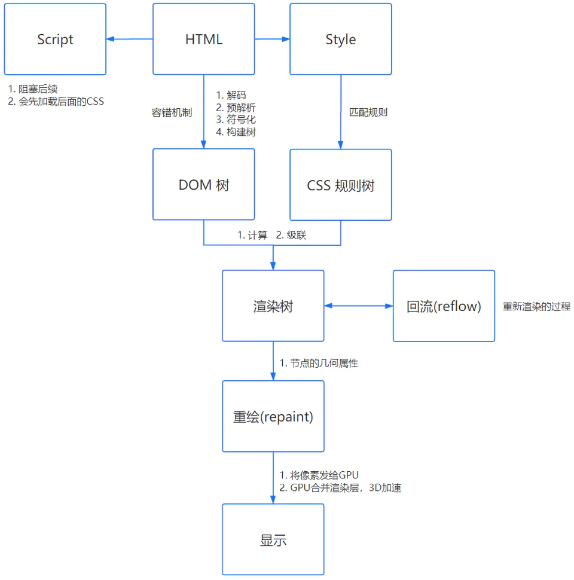

# 浏览器输入 URL 后发生了什么

参考
[浏览器输入 URL 后发生了什么？](https://zhuanlan.zhihu.com/p/43369093)
[在浏览器输入 URL 回车之后发生了什么（超详细版）](https://juejin.im/post/5d5e795ff265da03e275f29e)
[浏览器中输入 url 后发生了什么](https://www.jianshu.com/p/c1dfc6caa520)
[细说浏览器输入 URL 后发生了什么](https://juejin.im/post/5e32449d6fb9a02fe4581907)
[细说浏览器输入 URL 后发生了什么](https://segmentfault.com/a/1190000012092552)

[TOC]

从浏览器输入一个地址，敲回车以后，到页面记载完成，浏览器经历了哪些步骤呢？

- URL 解析
- DNS 域名解析
- 建立 TCP 连接(三次握手)
- 发送 HTTP 请求
- 服务器处理请求
- 返回响应结果
- 关闭 TCP 连接(四次挥手)
- 浏览器解析 HTML 并渲染

## URL 解析

**目的：**
处理输入到地址栏中的内容，进行不同的处理

**地址解析：**
首先判断你输入的是一个合法的 URL 还是一个待搜索的关键词，并且根据你输入的内容进行自动完成、字符编码等操作。

**HSTS：**
由于安全隐患，会使用 HSTS 强制客户端使用 HTTPS 访问页面。关于 HSTS [你所不知道的 HSTS](https://www.barretlee.com/blog/2015/10/22/hsts-intro/)

**其他操作：**
浏览器还会进行一些额外的操作，比如安全检查、访问限制（之前国产浏览器限制 996.icu）。

**检查缓存：**

## DNS 域名解析

**目的：**
将域名解析成对应的服务器 IP 地址

在浏览器输入网址，其实就是要向服务器请求我们想要的页面内容，所有浏览器首先要确认的是域名所对应的服务器在哪里。将域名解析成对应的服务器 IP 地址这项工作，是由 DNS 服务器来完成的。

**若果本地 DNS 服务器有缓存：**
`检查浏览器缓存` ---> `检查操作系统缓存` ---> `检查路由器缓存` ---> `检查 ISP DNS 缓存` ---> `检查根域名服务器`

**若果本地 DNS 服务器没有缓存：**
则不能直接将域名转换为 IP 地址，需要采用递归或者迭代查询的方式依次向**根域名服务器**、**顶级域名服务器**、**权威域名服务器**发起查询请求，直至找到一个或一组 IP 地址，返回给浏览器。

## 建立 TCP 连接

[三次握手和四次挥手](../网络/三次握手和四次挥手.md)

**目的：**
建立客户端跟服务器的信息传输通道

在上一步我们通过 DNS 解析拿到服务器 IP 地址后，浏览器再通过系统调用 Socket 接口与服务器 443 端口进行通信，首先就是浏览器要与服务器建立 TCP 连接（也就是**三次握手**）。

首先，判断是不是 https 的，如果是，则 HTTPS 其实是`HTTP + SSL / TLS`两部分组成，也就是在 HTTP 上又加了一层处理加密信息的模块。服务端和客户端的信息传输都会通过 TLS 进行加密，所以传输的数据都是加密后的数据。

- `（第一次握手）`客户端给服务器发送 SYN、MSS 的分组及额外信息；
- `（第二次握手）`服务器收到客户端的信息并发送带有 SYN+ACK 标志位的分组；
- `（第三次握手）`客户端确认收到服务器的分组，发送带有 ACK 标志位的分组，从而建立 TCP 连接。

**注意：**
**如果客户端此前未与服务器建立会话，那么双方需要进行一次完整的 TLS 四次握手**

- `（第一次握手）`客户端首先向服务器发送 Client Hello 报文，包含一个随机数、TLS 协议版本、按优先级排列的加密套件列表；
- `（第二次握手）`服务器向客户端发送 Server Hello 报文，包含一个新的随机数、TLS 协议版本、经过选择后的一个加密套件；服务器向客户端发送 Certificate 报文，包含服务器 X.509 证书链，其中，第一个为主证书，中间证书按照顺序跟在主证书之后，而根 CA 证书通常内置在操作系统或浏览器中，无需服务器发送；如果密钥交换选择 DH 算法，服务器会向客户端发送 Server Key Exchange 报文，包含密钥交换所需的 DH 参数；如果密钥交换选择 RSA 算法，则跳过这一步。服务器向客户端发送 Server Hello Done 报文，表明已经发送完所有握手消息；
- `（第三次握手）`客户端向服务器发送 Client Key Exchange 报文，如果密钥交换选择 RSA 算法，由客户端生成预主密钥，使用服务器证书中的公钥对其加密，包含在报文中，服务器只需使用自己的私钥解密就可以取出预主密钥；如果密钥交换选择 DH 算法，客户端会在报文中包含自己的 DH 参数，之后双方都根据 DH 算法计算出相同的预主密钥。需要注意的是，密钥交换的只是预主密钥，这个值还需进一步加工，结合客户端和服务器两个随机数种子，双方使用 PRF（pseudorandom function，伪随机函数）生成相同的主密钥；客户端向服务器发送 Change Cipher Spec 报文，表明已经生成主密钥，在随后的传输过程都使用这个主密钥对消息进行对称加密；客户端向服务器发送 Finished 报文，这条消息是经过加密的，因此在 Wireshark 中显示的是 Encrypted Handshake Message。如果服务器能解密出报文内容，则说明双方生成的主密钥是一致的。
- `（第四次握手）`服务器向客户端发送 New Session Ticket 报文，而这个 Session Ticket 只有服务器才能解密，客户端把它保存下来，在以后的 TLS 重新握手过程中带上它进行快速会话恢复，减少往返延迟；服务器向客户端发送 Change Cipher Spec 报文，同样表明已经生成主密钥，在随后的传输过程都使用这个主密钥对消息进行对称加密；服务器向客户端发送 Finished 报文，如果客户端能解密出报文内容，则说明双方生成的主密钥是一致的。至此，完成所有握手协商。

**备注：**

> ACK：此标志表示应答域有效，就是说前面所说的 TCP 应答号将会包含在 TCP 数据包中；有两个取值：0 和 1，为 1 的时候表示应答域有效，反之为 0。TCP 协议规定，只有 ACK=1 时有效，也规定连接建立后所有发送的报文的 ACK 必须为 1。
> SYN(SYNchronization)：在连接建立时用来同步序号。当 SYN=1 而 ACK=0 时，表明这是一个连接请求报文。对方若同意建立连接，则应在响应报文中使 SYN=1 和 ACK=1. 因此, SYN 置 1 就表示这是一个连接请求或连接接受报文。
> FIN(finis）即完，终结的意思，用来释放一个连接。当 FIN = 1 时，表明此报文段的发送方的数据已经发送完毕，并要求释放连接。

## 发送 HTTP 请求

**目的：**
给服务器发送所要请求的数据的信息

建立起安全的加密信道后，浏览器开始发送 HTTP 请求，一个请求报文由`请求行`、`请求头`、`空行`、`实体`（Get 请求没有）组成。

请求头由`通用首部`、`请求首部`、`实体首部`、`扩展首部`组成。

- 通用首部：表示无论是请求报文还是响应报文都可以使用，比如 Date；
- 请求首部：表示只有在请求报文中才有意义，分为 `Accept 首部`、`条件请求首部`、`安全请求首部`和`代理请求首部`这四类；
- 实体首部：作用于实体内容，分为`内容首部`和`缓存首部`这两类；
- 扩展首部：表示用户自定义的首部，通过 X- 前缀来添加。
- 另外需要注意的是：**HTTP 请求头是不区分大小写的**，它基于 ASCII 进行编码，而实体可以基于其它编码方式，由 Content-Type 决定。

### 请求方法

- `GET`：获取资源
- `POST`：传输实体主体
- `HEAD`：获取报文首部
- `PUT`：传输文件
- `DELETE`：删除文件
- `OPTIONS`：询问支持的方法
- `TRACE`：追踪路径

### 请求报文

## 服务器处理请求

**目的：**
将请求的数据按照请求的条件准备好

服务器端收到请求后的由 web 服务器（准确说应该是 http 服务器）处理请求，诸如 Apache、Ngnix、IIS 等。web 服务器解析用户请求，知道了需要调度哪些资源文件，再通过相应的这些资源文件处理用户请求和参数，并调用数据库信息，最后将结果通过 web 服务器返回给浏览器客户端。

## 返回响应结果

**目的：**
将请求的数据返回给客户端

浏览器接收到来自服务器的响应资源后，会对资源进行分析。
首先查看 Response header，根据不同状态码做不同的事（比如上面提到的重定向）。
如果响应资源进行了压缩（比如 gzip），还需要进行解压。
然后，对响应资源做缓存。
接下来，根据响应资源里的 MIME 类型去解析响应内容（比如 HTML、Image 各有不同的解析方式）。
此外，浏览器和服务器必须保证 HTTP 的传输顺序，各自维护的队列中请求/响应顺序必须一一对应，否则会出现乱序而出错的情况。

### 维持连接

完成一次 HTTP 请求后，服务器并不是马上断开与客户端的连接。在 HTTP/1.1 中，`Connection: keep-alive` 是默认启用的，表示持久连接，以便处理不久后到来的新请求，无需重新建立连接而增加慢启动开销，提高网络的吞吐能力。
在反向代理软件 Nginx 中，持久连接超时时间默认值为 75 秒，如果 75 秒内没有新到达的请求，则断开与客户端的连接。
同时，浏览器每隔 45 秒会向服务器发送 TCP keep-alive 探测包，来判断 TCP 连接状况，如果没有收到 ACK 应答，则主动断开与服务器的连接。
注意，HTTP keep-alive 和 TCP keep-alive 虽然都是一种保活机制，但是它们完全不相同，一个作用于应用层，一个作用于传输层。

### 状态码

- 1xx 接收的请求正在处理
- 2xx 请求正常处理完毕
- 3xx 需要进行附加操作以完成请求
- 4xx 服务器无法处理请求
- 5xx 服务器处理请求出错

### 响应报文

## 关闭 TCP 连接

**目的：**
当双方（客户端、服务器）超出设定时间没有请求或响应传递时，任意一方都可以发起关闭请求，以避免服务器与客户端双方的资源占用和损耗

- （第一次挥手）服务器向客户端发送 Alert 报文，类型为 Close Notify，通知客户端不再发送数据，即将关闭连接，同样，这条报文也是经过加密处理的；服务器通过调用 close 函数主动关闭连接，向客户端发送带有 FIN 标志位的分组，序列号为 m。
- （第二次挥手）客户端确认收到该分组，向服务器发送带有 ACK 标志位的分组，确认号为 m+1。
- （第三次挥手）客户端发送完所有数据后，向服务器发送带有 FIN 标志位的分组，序列号为 n。
- （第四次挥手）服务器确认收到该分组，向客户端发送带有 ACK 标志位的分组，序列号为 n+1。客户端收到确认分组后，立即进入 CLOSED 状态；同时，服务器等待 2 个 MSL(Maximum Segment Lifetime，最大报文生存时间) 的时间后，进入 CLOSED 状态。

## 浏览器解析 HTML 并渲染

[浏览器渲染原理及流程](./浏览器渲染原理及流程.md)

准确地说，浏览器需要加载解析的不仅仅是 HTML，还包括 CSS、JS。以及还要加载图片、视频等其他媒体资源。

### 基本流程

- 处理 HTML 标记并构建 DOM 树；
- 处理 CSS 标记并构建 CSS Rule Tree 树；
- 将 DOM 与 CSS Rule Tree 合并成一个渲染树；
- 根据渲染树来布局，以计算每个节点的几何信息；
- 将各个节点绘制到屏幕上。

### 具体流程

- 浏览器会将 HTML 解析成一个 DOM 树，DOM 树的构建过程是一个深度遍历过程：当前节点的所有子节点都构建好后才会去构建当前节点的下一个兄弟节点。
- 将 CSS 解析成 CSS Rule Tree 。
- 根据 DOM 树和 CSS Rule Tree 来构造 Rendering Tree。
  - **注意：**Rendering Tree 渲染树并不等同于 DOM 树，因为一些像 Header 或`display:none`的东西就没必要放在渲染树中了。
- 有了 Render Tree，浏览器已经能知道网页中有哪些节点、各个节点的 CSS 定义以及他们的从属关系。下一步操作称之为 layout，顾名思义就是计算出每个节点在屏幕中的位置。
- 再下一步就是绘制，即遍历 render 树，并使用 UI 后端层绘制每个节点。
