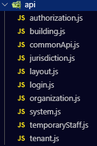
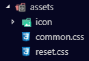
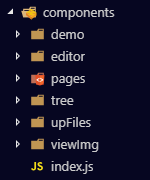
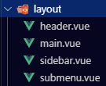
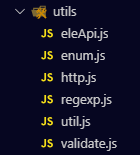
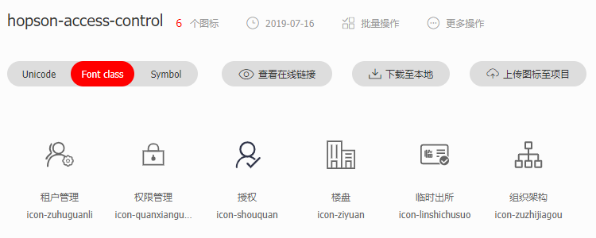

# 后台管理系统

基于 Vue.js 2.x + Element UI 的后台管理系统解决方案。

## 前言

- 此模板在 [vue-manage-system](https://github.com/lin-xin/vue-manage-system) 基础之上开发。
- 改造没有十分完善，可查看上面链接根据需求进行补充完善

## 目录结构介绍（开发前请对目录结构有总体的了解）

```txt
|-- build                                // webpack配置文件（一般不会修改这里的文件）
|-- config                               // 项目打包路径（一般不会修改这里的文件）
|-- src                                  // 源码目录（这里是开发目录）
|    |-- api                             // 各个页面的接口集合，文件名跟views下面的文件目录一一对应
|    |    |-- login.js                   // 登录页接口
|    |    |-- ...                        // 其他页面接口，跟views下面的文件目录一一对应
|    |    |-- commonApi.js               // 公共接口，这里写的api不止一个页面会用到，当一个相同的api被拷贝到几个地方使用时不容易维护，所以被提出来维护
|    |-- assets                          // 静态文件（项目中用到的样式、字体图标、图片等文件）
|    |    |-- common.css                 // 公共样式（写一些全局都会用到的样式）
|    |    |-- reset.css                  // 重置样式
|    |    |-- icon                       // iconfont 图标
|    |    |-- images                     // img 图片
|    |-- components                      // 组件（自定义组件，一个功能的组件一个文件夹，在不影响正常功能的情况下，可以对现有自定义组件进行改造完善）
|    |    |-- editor                     // 富文本编辑器
|    |    |-- pages                      // 分页
|    |    |-- tree                       // 树形组件
|    |    |-- upFiles                    // 上传组件
|    |         |-- upFile                // 上传excel
|    |         |-- upImg                 // 上传图片
|    |    |-- viewImg                    // 查看图片组件
|    |    |-- index.js                   // 写完组件后，先在这里 import 然后 通过 install 的 Vue.component 注册组件，之后可以在全局使用
|    |-- config                          // 全局配置文件（登录后跳转的首页的路由 name[HOME]，公共的URL的部分[baseHost]， 项目名[project_name]）
|    |-- layout                          // 页面布局文件
|    |    |-- header                     // 头部部分（登录后界面最顶部的部分，包含切换项目、修改密码、退出登录逻辑）
|    |    |-- main                       // 主体部分（界面主体部分，包含了侧边和头部）
|    |    |-- sidebar                    // 侧边部分（设置权限菜单及侧边结构）
|    |    |-- submenu                    // 侧边部分组件（支持多层级结构）
|    |-- mixin                           // 混入
|    |    |-- listMixin                  // 列表混入
|    |    |-- detailMixin                // 详情混入
|    |-- router                          // 路由
|    |    |-- index                      // 路由导出文件
|    |    |-- router                     // 路由详情
|    |-- store                           // 全局状态
|    |    |-- index                      // 对需要保存到本地的变量进行全局状态管理
|    |    |-- storage                    // token、userId、userName等，需要保存在本地的变量的集合
|    |-- utils                           // 工具文件
|    |    |-- eleApi                     // 对element UI常用组件简单封装，减少每次写配置项，定义在全局，可以直接使用
|    |    |-- enum                       // 搜索项或表格常用到的选项
|    |    |-- http                       // 发送请求前、请求后的处理
|    |    |-- regexp                     // 常用正则
|    |    |-- util                       // 常用工具类（手机格式处理，货币格式处理，时间格式处理...）
|    |    |-- validate                   // 常用表单检验
|    |-- vendor                          //
|    |-- views                           // 页面文件（按照原型图划分页面，quickentry页面 没有使用，需要的话可作为首页）
|    |-- App.vue                         // 页面入口文件
|    |-- main.js                         // 程序入口文件，加载各种公共组件
|    |-- static                          // 后台主体用静态文件
|-- .babelrc                             // ES6语法编译配置
|-- .editorconfig                        // 代码编写格式的基础规范
|-- .eslintignore                        // eslint 忽略文件
|-- .eslintrc.js                         // eslint 代码检测规则文件
|-- .postcssrc.js                        // 添加浏览器私缀
|-- .gitignore                           // git版本库忽略的文件
|-- index.html                           // 入口html文件
|-- package.json                         // 项目及工具的依赖配置文件
|-- README.md                            // 说明
```

这里来简单讲一下 src 文件包含了那些

### api

- 这里是所有页面用到的 api 的集合，如图可见模块有很多，而且随着业务的迭代，模块还会会越来越多。
- 所以这里建议根据业务模块来划分目录，并且 将 views 和 api 两个模块一一对应，从而方便维护。
- 一些公共部分的用到的 api 放在 `commonApi.js`，集中维护。



- api 文件引入 `http`（请求模块） 和 `config` （全局配置模块），每一个接口都用 `export` 导出，并要写明接口是做什么用的。

```js
import http from '@/utils/http'
import { baseHost } from '@/config'

/* ==================== login ==================== */

/**
 * 登录页---获取验证码
 * @param {*} params
 */
export function getNumberVcode(params) {
  return http.get(`${baseHost}/auth/getMobileVerificationCode`, {
    params: params,
  })
}

/**
 * 获取省份
 */
export function getProvinceList() {
  return http.get(`${baseHost}/common/getSysCityList`, {
    params: { type: '1' },
  })
}

/**
 * 获取市
 * @param {*} params
 */
export function getCityList(params) {
  return http.get(`${baseHost}/common/getSysCityList`, {
    params: { type: '2', ...params },
  })
}

/**
 * 获取县(区)
 * @param {*} params
 */
export function getAreaList(params) {
  return http.get(`${baseHost}/common/getSysCityList`, {
    params: { type: '3', ...params },
  })
}
```

### assets

- 这里存放用到的静态文件，css、img 图片、icon 图标等。
- reset.css 是对页面元素基础样式进行统一，确保在每个浏览器都有一样的样式。
- common.css 是页面中用到的公共部分的样式。
- images 中是页面用到的图片。
- icon 中是项目侧边、还有页面中用的的图标，使用的是阿里的 [iconfont](https://www.iconfont.cn/)



### components

- 这里放置的都是全局公用的一些组件，如：富文本编辑器、分页、树形组件、图片文件上传、查看图片等。



- 写好一个组件后需要在此文件夹下的 `index.js` 引入，并通过 `install` 的 `Vue.component` 注册组件，然后就可以在全局使用写好的组件了

```js
// components/index.js
/**
 * 自定义组件导出文件
 * 自定义组件写在components里面，一个功能的组件一个文件夹
 * 写完组件后，现在这里 import 然后 Vue.component 使用，之后可以在全局使用
 * 在不影响正常功能的情况下，可以现有对自定义组件进行改造完善
 */
import UpImg from './upFiles/upImg.vue' // 上传图片
import UpFile from './upFiles/upFile.vue' // 上传excel文件
import BtnUpImg from './upFiles/btnUpImg.vue' // 按钮上传图片
import Editor from './editor/editor.vue' // 编辑器
import Pages from './pages/pages.vue' // 分页
import Tree from './tree/tree.vue' // 树形结构

export default {
  // 核心部分，在我们使用Vue.use()时，自动调用的是install，而install导出的必须是的组件
  install(Vue) {
    Vue.component('up-img', UpImg)
    Vue.component('up-file', UpFile)
    Vue.component('btn-upimg', BtnUpImg)
    Vue.component('Editor', Editor)
    Vue.component('pages', Pages)
    Vue.component('h-tree', Tree)
  },
}

// main.js

import components from './components/index'

Vue.use(components)
```

### config

- 全局配置文件，这里声明了 api 的公共请求部分、进入项目后的首页、项目名称等

```js
/**
 * 全局变量配置文件
 * 可被其他文件引入后使用
 */
// 公共的URL的部分
let baseHost = '' // eslint-disable-line
const HOME = 'tenantList' // 登录后跳转的首页的路由 name
const project_name = '项目名' // 项目名

if (location.hostname === 'acs.hopsontong.com') {
  baseHost = 'https://acs.hopsontong.com/acs-cms'
} else if (location.hostname === 'tacs.hopsontong.com') {
  baseHost = 'https://tacs.hopsontong.com:11013/acs-cms'
} else {
  baseHost = 'https://kfacs.hopsontong.com:11013/acs-cms'
}

export { baseHost, HOME, project_name }
```

### layout

- 这里是页面的布局部分，页面主要分为三个部分，头部（header）、侧边（sidebar）和主体部分（main）。
- submenu 是 sidebar 的一个组件，支持了多层级结构



### mixin

- 这里是全局的混入，存放了页面中共有的 data 数据、运行时、方法等，引入页面后可以减少一些冗余的代码。

```js
import listMixin from '@/mixin/listMixin'

export default {
  ...
  mixins: [listMixin],
  ...
}
```

### router

- 全局路由管理，在 `router.js` 文件声明了所有页面的路由。
- 项目中使用了 [alias](https://webpack.js.org/configuration/resolve/)，声明了 `@` 代表 `src`、`_path` 代表 `src/views`，这在项目大了以后，目录比较多的情况下减少了一层一层向上查找文件的麻烦。
- 因为要都所有路径所权限管理，所以给每一个路由定义了 meta 参数，在路由跳转的时候传一些参数，在参数比较多的情况下，每一个路由都要写一次就产生了冗余代码，所以单独提出了 `_meta` 方法，简化了每次都要写重复的代码

```js
// @ 为 src 见 build/webpack.base.conf.js
// _path 为 src/views 见 build/webpack.base.conf.js
/**
 *
 * @param {Object} obj meta 参数
 * rel 当前锚点（地址）用于高亮侧边栏对应的栏目
 * keepAlive 使用keep-livea缓存当前页
 * requireAuth 验证
 * isBack 是否是直接返回本页
 * isEdit 是否是编辑后返回本页
 * isAdd 是否是添加后返回本页
 * isSave 是否是保存后返回本页
 */
const _meta = obj => {
  return { ...{ rel: '', keepAlive: false, requireAuth: true, isBack: false, isEdit: false }, ...obj }
}

{
  path: '/tenantList',
  name: 'tenantList',
  component: () => import('_path/tenantManagement/tenantList'),  // 租户列表
  meta: _meta({ rel: 'tenantList', keepAlive: true })
},
```

### store

- 全局状态管理，这里维护了一些全局的数据，如：每次请求时需要在请求头使用的 token 验证、权限列表、用户名、用户手机号等信息，它的作用是为了可以在不同页面中使用同样的信息，并且在一个页面中修改之后，其他页面也能使用被修改后的数据，实现了页面间的通信。

### utils

- 这里放了一些工具类，公共的方法等。
- eleApi 是对所使用的 elementUI 的一些方法进行二次封装，减少了每次都要写一些配置，现在直接调用即可。
- enum 存放了一些常用的枚举属性，减少了每次使用是都要重写一遍，现在只用直接调用即可。
- http 封装了 axios，对请求前和请求后的数据做了一些处理。
- regexp 是一些常用的正则方法，如：手机号、邮箱、身份证的验证等。
- util 是一些常用的公共方法，如：手机号格式化、日期格式化、数字的货币格式处理等。
- validate 是一些常用表单的校验方法。



### views

- 这里是页面部分，每一块都有单独的文件夹区分，当项目页面很庞大时，这是很有必要的，可以是结构更清晰。

## ESLint

- 不管是多人合作还是个人项目，代码规范是很重要的。这样做不仅可以很大程度地避免基本语法错误，也保证了代码的可读性。推荐 eslint+vscode 来写 vue，可以保证代码有一个很好的规范性。
- 这里的 `eslint.js` 文件，也配置了一些常用的规范，保证了代码的可维护性。

```js
// https://eslint.org/docs/user-guide/configuring
// http://eslint.cn/

module.exports = {
  // 此项是用来告诉eslint找当前配置文件不能往父级查找
  root: true,
  env: {
    browser: true,
    es6: true,
  },
  extends: [
    'plugin:vue/essential',
    'airbnb-base',
    'eslint:recommended',
  ],
  // http://eslint.cn/docs/user-guide/configuring#specifying-globals
  globals: {
    Atomics: 'readonly',
    SharedArrayBuffer: 'readonly',
    Vue: 'writable',
  },
  parserOptions: {
    // 此项是用来指定eslint解析器的，解析器必须符合规则，babel-eslint解析器是对babel解析器的包装使其与ESLint解析
    parser: 'babel-eslint',
    ecmaVersion: 2018,
    sourceType: 'module',
    ecmaFeatures: {
      "jsx": true
    },
  },
  plugins: [
    'vue',
  ],
  // add your custom rules here
  // 查看官网 添加、修改 规则 http://eslint.cn/docs/rules/

  // inline rules http://eslint.cn/docs/user-guide/configuring#disabling-rules-with-inline-comments
  // 某一特定的行上禁用所有规则
  // eslint-disable-line
  /* eslint-disable-line */
  // eslint-disable-next-line
  /* eslint-disable-next-line */

  // 规则参数
  // "off" 或 0 - 关闭规则
  // "warn" 或 1 - 开启规则，使用警告级别的错误：warn (不会导致程序退出)
  // "error" 或 2 - 开启规则，使用错误级别的错误：error (当被触发的时候，程序会退出)
  rules: {
    // allow debugger during development
    'no-debugger': process.env.NODE_ENV === 'production' ? 2 : 0,
    'no-console': process.env.NODE_ENV === 'production' ? 2 : 0,
    // 要求或禁止使用分号代替 ASI
    "semi": [2, "never"],
    ...
  },
}
```

## Less

- 这里支持了 css 预编译器 less，使用 less 书写样式可以使结构和页面结构一样更清晰，变量及一些函数的使用，大大强化了 css 的能力，使得提升开发效率。

## axios

- 在业务代码中，每次的请求都会请求头中携带一些可以校验权限的 token 信息，针对这种情况，在 axios 的每次发送请求前，都会在请求头添加 `X-Access-Token` 字段，以校验请求的合法性，同样也可以对响应的数据做一些处理。

```js
import Vue from 'vue'
import axios from 'axios'
import { Message } from 'element-ui' /* MessageBox,  */
import store from '@/store'

const http = axios.create({
  timeout: 30000, // request timeout
})

http.interceptors.request.use(
  (config) => {
    // 这里的config包含每次请求的内容
    if (store.state.token) {
      config.headers['X-Access-Token'] = store.state.token
    }
    return config
  },
  (err) => Promise.reject(err)
)

http.interceptors.response.use(
  (response) => {
    return response.data
  },
  () => {
    Message.warning('网络错误，请刷新重试')
  }
)

Vue.prototype.$http = http

export default http
```

## iconfont

- 由于 elementUI 提供的图标有限，项目中使用的是阿里的 [iconfont](https://www.iconfont.cn/)
- iconfont 使用起来也很简单，以下是使用步骤

1、在[iconfont](https://www.iconfont.cn/)网站新建项目，并把需要的图标添加到项目中



2、把 iconfont 网站提供的代码下载至本地，并添加到项目的 `src/assets/icon` 目录下

3、在 `main.js` 中引入，之后就可以按照 iconfont 提供的使用方法全局使用了

```js
// main.js 引入
import './assets/icon/iconfont.css'

// 页面中使用
;<span class="icon iconfont icon-zuhuguanli" />
```

## 安装

- 查看 admin-template 项目时
  - `npm i` （如果没有安装依赖，则安装依赖）
  - 安装好依赖后，执行 使用 步骤
- 以 admin-template 为模板开发其他项目时
  - 复制 admin-template 内的全部内容到新建的项目中
  - `npm i` （如果没有安装依赖，则安装依赖）
  - 安装好依赖后，执行 使用 步骤

## 使用

### 本地开发

```bash
npm run dev
// 开启服务器，浏览器自动访问 http://localhost:8080
```

### 构建生产

```bash
npm run build
// 执行构建命令，生成的dist文件夹放在服务器下即可访问
```

## 注意事项

### README 目录结构介绍对每个文件都进行了说明，如有疑问可提出讨论

### 修改项目名

- 修改最外层 `index.html` 的 `title`
- 修改 `src/config/index.js` 的 `project_name`

### 防止多人开发时产生冲突图，使用 `npm` 安装依赖包

- `npm i <package_name> -S` 安装指定包到 dependencies（生产环境需要用到）

- `npm un <package_name> -S` 删除 dependencies 的指定包

- `npm update <package_name> -S` 更新 dependencies 的指定包

- `npm i <package_name> -D` 安装指定包到 devDependencies（开发环境需要用到）

- `npm un <package_name> -D` 删除 devDependencies 的指定包

- `npm update <package_name> -D` 更新 devDependencies 的指定包

### 版本

`package.json` 里有各依赖包的版本，查看文档时注意查看对应版本的文档

- `axios` `0.18.1`
- `element-ui` `2.10.1`
- `js-md5` `0.7.3`
- `vue` `2.6.10`
- `vue-router` `3.0.7`
- `vuex` `3.1.1`

### 变量命名

- 变量命名语义化，使用英文翻译，不要使用拼音及缩写
- 类名使用短横杠`-`拼接命名（例如：`admin-template`）
- 文件名、变量名、函数名使用驼峰命名（例如：`userName`）
- 自定义组件名使用短横杠`-`拼接命名（例如：`up-file`）

### 代码规范

参照

- [coding-specification (代码规范)](https://github.com/yhb-flydream/docs/blob/master/%E4%BB%A3%E7%A0%81%E8%A7%84%E8%8C%83/%E4%BB%A3%E7%A0%81%E8%A7%84%E8%8C%83.md)
- [`Google HTML/CSS Style Guide`](https://google.github.io/styleguide/htmlcssguide.html)
- [`Google JavaScript Style Guide`](https://google.github.io/styleguide/jsguide.html)
- [`Code Guide`](http://alloyteam.github.io/CodeGuide/)
- [`google JSDoc`](https://github.com/google/closure-compiler/wiki/Annotating-JavaScript-for-the-Closure-Compiler)
- [`JSDoc Guide`](http://yuri4ever.github.io/jsdoc/)
- [`usejsdoc`](http://usejsdoc.org/)
- [`airbnb Github`](https://github.com/airbnb/javascript)
- [`Airbnb JavaScript 编码规范(涵盖 ECMAScript 6+)`](https://www.css88.com/archives/8345)

尽量使用编辑器

### 写注释

- 变量---需要写明变量代表什么意思
- 方法---需要写明方法的作用，参数的代表什么，如果方法比较复杂，有必要进行拆分，还需要写明步骤

### 使用 Less 预编译写 css

项目中可以使用 less 编写样式

### 切换主题

打开 `src/App.vue` 文件，找到 `style` 标签

- 一、使用深色主体

使用 `@import "../static/css/theme-dark.css";`
注释 `@import "../static/css/theme-customize.less";`

```less
@import '../static/css/theme-dark.less'; /* 深色主题 */
/* @import "../static/css/theme-customize.less"; */ /* 自定义主题 */
```

找到 `src/views/login/bubble.js`，修改 todo 处

- 二、使用自定义主题

使用 `@import "../static/css/theme-customize.less";`
注释 `@import "../static/css/theme-dark.css";`

```less
/* @import "../static/css/theme-dark.less"; */ /* 深色主题 */
@import '../static/css/theme-customize.less'; /* 自定义主题 */
```

使用自定义主题时需要手动修改主题色：

- 找到 `static/css/theme-customize.less`，修改 `@color-theme` 为自定义颜色（todo 处都需要修改）
- 找到 `src/views/login/bubble.js`，修改 todo 处
