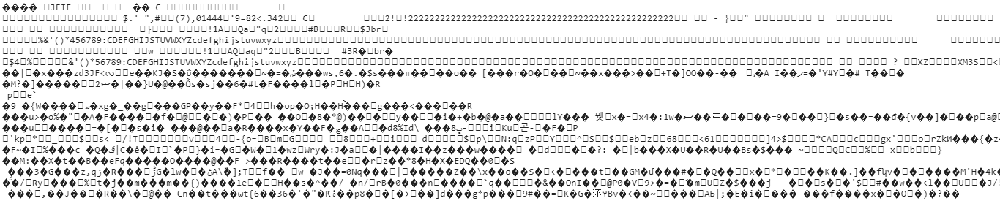

# 前端接收数据流图片展示（使用axios）

[TOC]

- [参照](https://www.cnblogs.com/cdemo/p/5225848.html)

## 问题

后端给的数据流接口本来可以直接作为图片的src使用展示图片，但是作为图形验证码来使用，还需要局部刷新，所以还是要请求接口的

但是请求接口返回的数据格式为二进制流格式，不能直接放到img的src里面展示



查看接口返回的preview里面是可以展示的


## 原因

这是因为接口返回的是二进制流格式，但是使用axios请求数据的响应数据类型(`responseType`)默认是 `json` 格式[详情](http://www.axios-js.com/zh-cn/docs/#%E8%AF%B7%E6%B1%82%E9%85%8D%E7%BD%AE)

知道原因了下面就按步骤解决问题：

- 1、首先要把响应数据类型设置为`blob`类型

```js
// `responseType` 表示服务器响应的数据类型，可以是 'arraybuffer', 'blob', 'document', 'json', 'text', 'stream'

responseType: 'blob'
```

设置完成后返回数据变成了`blob`格式


但是blob格式数据也不能直接在img的src使用

这时候需要用一个方法[`URL.createObjectURL()`](https://developer.mozilla.org/zh-CN/docs/Web/API/URL/createObjectURL)对返回的`blob`数据进行转化

进行转化后的数据就可以放在src中显示了，然后进行下一步

- 2、然后在请求接口成功返回result的地方对blob进行转化

```js
this.imgSrc =  URL.createObjectURL(result)
```

这时候图片就可以在页面展示出来了，但是在每次调用 `createObjectURL()` 方法时，都会创建一个新的 URL 对象，即使你已经用相同的对象作为参数创建过，为了获得最佳性能和内存使用状况，你应该在安全的时机主动释放掉它们[详情](https://developer.mozilla.org/zh-CN/docs/Web/API/URL/createObjectURL#Notes)

所以就需要用 [`URL.revokeObjectURL()`](https://developer.mozilla.org/zh-CN/docs/Web/API/URL/revokeObjectURL) 方法来释放已经创建的 URL 对象

这是接下来一步需要做的

- 3、释放已经创建的 URL 对象

```js
URL.revokeObjectURL(img.src)
```

## 完整代码

```js
axios({
  url: 'url',
  responseType: 'blob'
}).then((res) => {
  this.imgSrc = URL.createObjectURL(res)
  this.$refs.Img.onload = function (e) {
    URL.revokeObjectURL(this.$refs.Img.src); // 释放
  };
})
```
